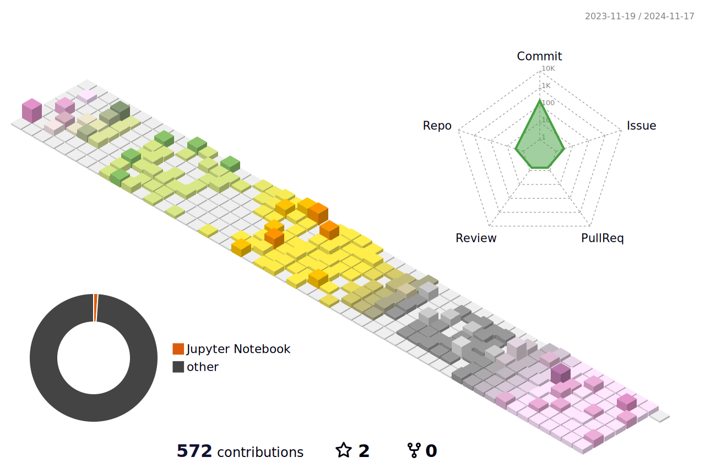

```
▬▬▬▬.◙.▬▬▬▬
  ▂▄▄▓▄▄▂                                                              ╫►►        ▁▁ ▓
◢◤ █▀▀████▄▄▄▄▄▄▄◢◤            ● ● ● ▄▄▄▄▄▄▄████▮                     ╫       █████████
█  Ruyi's Github █▀▀▀▀╬            ▂▃▄▅████▀▀▀████▅▄                ╫    ▟██⍁██⍁██⍁███▙
◥█████████◤                     ▄█████   ML x Bio  █████▄          ▜████  Get off work!  ████▛
══╩════╩══                         ◥⊙▲⊙▲⊙▲⊙▲⊙▲⊙▲⊙▲⊙▲⊙▲◤              ▜███████████████████▛╬
░░░░░░░░░░░░░░░░░░░░░░░░░░░░░░░░░░░░░░░░░░░░░░░░░░░░░░░░░░░░░░░░░░░░░░░░░░░░░░░░░░░░░░░░░░░░░░░
```



- 🎀 Hi there, I'm Ruyi Chen, a second-year PhD student at UQ <br>
- 🌷 I explore protein evolution and mutation effects through biological language models <br>
- 🧠 I'm interested in applying machine learning to biology <br>
- 🎟️ Outside of research, I enjoy reading detective novels (✅), and watching plays <br>


